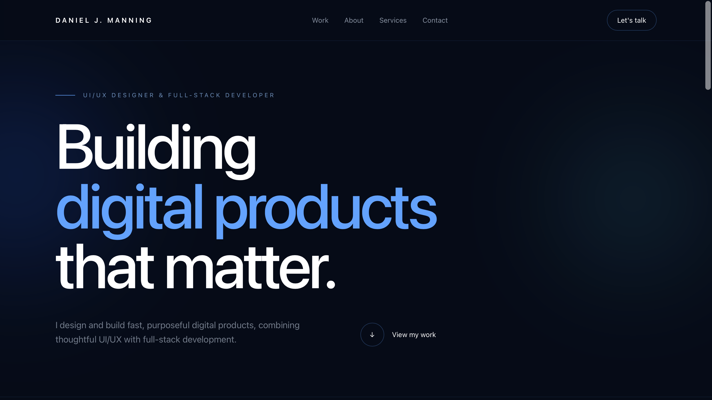
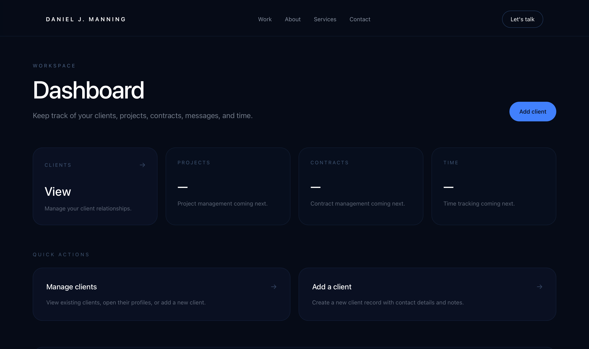

# Daniel J. Manning — Portfolio & Client Workspace

A fast, server-rendered developer portfolio and internal client-management workspace built with Go, HTMX, Tailwind CSS and SQLite.

The public website presents my UI/UX design and full-stack development work. Behind it, the application includes an internal workspace for managing clients and is being expanded to support projects, contracts, messaging, time tracking and an invitation-only customer portal.

## Screenshots

### Public portfolio



### Internal client workspace



## Current Features

### Public portfolio

- Responsive portfolio homepage
- Selected-work section
- About and capabilities sections
- Contact call to action
- Shared layout, header and footer templates
- Tailwind CSS visual system
- Server-rendered pages using Go templates

### Internal workspace

- Dashboard overview
- Client listing
- Client detail pages
- Create clients
- Edit clients
- Delete clients with HTMX confirmation
- Active and inactive client statuses
- Server-side form validation
- SQLite persistence with foreign-key enforcement
- Automatic database migrations
- Automated HTTP, database and repository tests
- HTMX-aware redirect handling after client deletion

## Technology

- **Backend:** Go and the standard-library `net/http` package
- **Templates:** Go `html/template`
- **Interactivity:** HTMX
- **Styling:** Tailwind CSS v4
- **Database:** SQLite using `modernc.org/sqlite`
- **Architecture:** HTTP handler → repository → SQLite
- **Testing:** Go `testing`, `httptest` and in-memory SQLite databases

The application deliberately avoids a heavy frontend framework. Most pages are rendered on the server, while HTMX is used for focused interactions such as deleting clients and redirecting back to the client-management page.

## Project Structure

```text
.
├── cmd
│   └── server
│       └── main.go
├── internal
│   ├── config
│   ├── database
│   ├── http
│   ├── models
│   └── repository
├── migrations
│   └── 001_initial.sql
├── web
│   ├── static
│   │   ├── css
│   │   │   └── input.css
│   │   └── images
│   │       ├── djmdev-homescreen.png
│   │       └── internal-workspace.png
│   └── templates
│       ├── components
│       ├── layouts
│       └── pages
├── go.mod
├── go.sum
├── package.json
├── package-lock.json
├── LICENSE
└── README.md
```

## Application Architecture

The application is intentionally organised into small, understandable layers.

```text
Browser request
      ↓
HTTP handler
      ↓
Repository
      ↓
SQLite
      ↓
Go model
      ↓
HTML template
      ↓
Browser response
```

Each layer has a specific responsibility:

- `cmd/server` opens the database, constructs handlers, registers routes and starts the server.
- `internal/http` handles HTTP methods, paths, forms, validation, responses and template rendering.
- `internal/repository` contains parameterised SQL queries and persistence logic.
- `internal/models` defines the Go data structures used by the application.
- `internal/database` opens SQLite, enables foreign keys and runs migrations.
- `internal/config` loads application configuration from environment variables.
- `web/templates` contains page, layout and shared component templates.
- `web/static` contains Tailwind source files and repository screenshots.

### Example client-update flow

```text
POST /dashboard/clients/5
      ↓
ClientsHandler.handlePOST
      ↓
ClientsHandler.updateClient
      ↓
ClientRepository.Update
      ↓
UPDATE clients
      ↓
303 redirect to /dashboard/clients/5
```

### Example HTMX deletion flow

```text
Delete button
      ↓
HTMX DELETE /dashboard/clients/5
      ↓
ClientsHandler.handleDeleteClient
      ↓
ClientRepository.Delete
      ↓
HX-Redirect: /dashboard/clients
      ↓
Browser loads the client list
```

## Local Development

### Requirements

- Go 1.26.5 or newer
- Node.js
- npm
- Git
- SQLite command-line tools are optional but useful for inspecting the development database

### Clone the repository

```bash
git clone https://github.com/danieljmanningdev/danieljmanningdev-portfolio.git
cd danieljmanningdev-portfolio
```

### Install frontend tooling

```bash
npm ci
```

### Build Tailwind CSS

```bash
npm run build:css
```

The generated stylesheet is written to:

```text
web/static/css/app.css
```

The generated CSS file is ignored by Git and should be rebuilt after cloning the repository or before deployment.

### Watch Tailwind during development

Run this in a separate terminal:

```bash
npm run dev:css
```

Tailwind will rebuild the stylesheet when template classes change.

### Start the Go server

```bash
go run ./cmd/server
```

The development server starts at:

```text
http://localhost:8080
```

### Useful Routes

| Route | Purpose |
|---|---|
| `/` | Public portfolio |
| `/health` | JSON health check |
| `/dashboard/` | Internal workspace overview |
| `/dashboard/clients` | Client listing |
| `/dashboard/clients/new` | Create-client form |
| `/dashboard/clients/{id}` | Client detail page |
| `/dashboard/clients/{id}/edit` | Edit-client form |

## Configuration

The application reads configuration from environment variables and falls back to development defaults when values are not provided.

| Variable | Default | Purpose |
|---|---|---|
| `APP_ENV` | `development` | Application environment |
| `APP_PORT` | `8080` | HTTP server port |
| `DATABASE_PATH` | `./data/app.db` | SQLite database path |
| `TEMPLATE_DIR` | `web/templates` | Go template directory |

Example:

```bash
APP_ENV=development \
APP_PORT=9090 \
DATABASE_PATH=./data/development.db \
TEMPLATE_DIR=web/templates \
go run ./cmd/server
```

Local environment files and database files are excluded from Git.

## Database

SQLite is opened through `modernc.org/sqlite`.

The database layer:

- Creates the database directory when required
- Enables SQLite foreign-key enforcement
- Verifies that foreign-key enforcement is active
- Uses a single connection for in-memory test databases
- Runs versioned SQL migrations when the application starts
- Tracks applied migrations in `schema_migrations`

The current schema contains foundations for:

- Clients
- Projects
- Contracts
- Messages
- Time entries

Relationships between these records are protected using SQLite foreign keys.

### Inspect the development database

```bash
sqlite3 data/app.db
```

Useful SQLite commands:

```sql
.tables
.schema clients
SELECT * FROM clients;
SELECT * FROM schema_migrations;
```

Exit SQLite with:

```text
.quit
```

## Client Management

The current client feature supports the complete basic CRUD lifecycle:

```text
Create
Read
Update
Delete
```

### Repository operations

```go
List()
GetByID()
Create()
Update()
Delete()
```

### HTTP operations

```text
GET     /dashboard/clients
GET     /dashboard/clients/new
POST    /dashboard/clients/new
GET     /dashboard/clients/{id}
GET     /dashboard/clients/{id}/edit
POST    /dashboard/clients/{id}
DELETE  /dashboard/clients/{id}
```

### Current validation

Client forms currently validate:

- Required name
- Required email
- Valid email format
- Allowed client statuses
- Whitespace trimming

Valid statuses are currently:

```text
active
inactive
```

## Testing

### Run all tests

```bash
go test ./...
```

### Run tests verbosely

```bash
go test -v ./...
```

### Run package-specific tests

```bash
go test ./internal/database
go test ./internal/repository
go test ./internal/http
```

### Run static analysis

```bash
go vet ./...
```

### Check formatting

```bash
gofmt -w .
```

### Check for whitespace errors

```bash
git diff --check
```

### Full local verification

```bash
gofmt -w .
go test ./...
go vet ./...
npm run build:css
git diff --check
```

The test suite currently covers:

- Configuration defaults and environment overrides
- Database opening and connectivity
- Automatic database-directory creation
- Migration ordering and idempotency
- Failed migration handling
- SQLite foreign-key enforcement
- Client creation
- Client validation
- Client updates
- Client `updated_at` behaviour
- Missing-client responses
- Client deletion
- HTMX deletion redirects
- Health endpoint behaviour
- Homepage rendering

## Roadmap

### Client management

- [x] List clients
- [x] View client details
- [x] Create clients
- [x] Edit clients
- [x] Delete clients
- [x] Validate client input
- [x] Support active and inactive statuses
- [x] Test create, update and delete flows
- [x] Add HTMX deletion confirmation and redirects
- [ ] Add styled edit-form validation errors
- [ ] Add client search
- [ ] Add status filtering
- [ ] Add client archiving
- [ ] Prefer archiving over permanent deletion for real client records
- [ ] Add client activity summaries

### Project management

- [ ] Project listing
- [ ] Project detail pages
- [ ] Create projects
- [ ] Edit projects
- [ ] Archive projects
- [ ] Associate projects with clients
- [ ] Project statuses
- [ ] Start dates and due dates
- [ ] Project activity history

### Contract management

- [ ] Contract listing
- [ ] Associate contracts with clients
- [ ] Associate contracts with projects
- [ ] Draft, sent, signed and completed statuses
- [ ] Contract values
- [ ] Contract start and end dates
- [ ] Document delivery
- [ ] Electronic signing workflow

### Messaging

- [ ] Client conversations
- [ ] Project-specific conversations
- [ ] Read and unread states
- [ ] Message notifications
- [ ] Internal and client-facing messages

### Time tracking

- [ ] Manual time entries
- [ ] Start and stop timer
- [ ] Billable and non-billable time
- [ ] Project totals
- [ ] Client totals
- [ ] Time reports

### Files and billing

- [ ] Project files
- [ ] Client deliverables
- [ ] Invoices
- [ ] Payment statuses
- [ ] Stripe billing integration

### Security and portal access

- [ ] Admin authentication
- [ ] Secure server-side sessions
- [ ] HTTP-only secure cookies
- [ ] CSRF protection
- [ ] Authorization middleware
- [ ] Role and permission checks
- [ ] Invitation-only customer portal
- [ ] Portal users linked to client records
- [ ] Client-scoped data access

There will be no public customer-registration flow.

Clients will be accepted and created internally before receiving invitation-only access to their workspace.

## Deployment Status

The public portfolio can be prepared for deployment, but the internal dashboard is currently intended for local development.

The dashboard must not be exposed publicly until the following are implemented:

- Admin authentication
- Session management
- Authorization
- CSRF protection
- Secure cookies
- Production security headers
- Appropriate server timeouts
- Persistent deployment storage for SQLite

## Design Philosophy

This project is built around a small set of principles:

- Prefer server-rendered HTML when a JavaScript application is unnecessary.
- Use HTMX for focused interactions rather than introducing a large frontend framework.
- Keep SQL and persistence logic out of HTTP handlers.
- Keep HTTP concerns out of repositories.
- Use small, understandable layers.
- Build fast interfaces without unnecessary frontend bloat.
- Treat clients as the centre of future projects, contracts, messages and time tracking.
- Add abstractions only when repeated application behaviour justifies them.
- Keep the public portfolio polished while building the internal system incrementally.

## Planned Request Flow

Future application domains will follow the same vertical structure:

```text
Model
  ↓
Migration
  ↓
Repository
  ↓
Service or validation layer
  ↓
HTTP handler
  ↓
Template
  ↓
Automated tests
```

Projects will be the next major domain and will belong to clients.

Contracts, messages and time entries will then connect to projects and client records.

## Customer Portal Direction

The eventual customer portal will be invitation-only.

The intended workflow is:

```text
Potential client contacts Daniel
        ↓
Client is qualified and accepted
        ↓
Daniel creates the client record
        ↓
Projects and contracts are created
        ↓
Portal access is enabled
        ↓
Client receives a secure invitation
        ↓
Client can access only their own workspace
```

The public website will not contain a customer sign-up form.

## Licence

This project is licensed under the MIT Licence.

Copyright © 2026 Daniel J. Manning.
